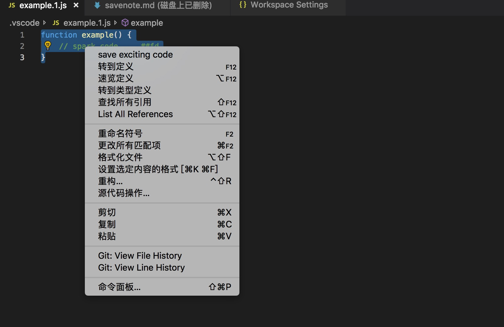
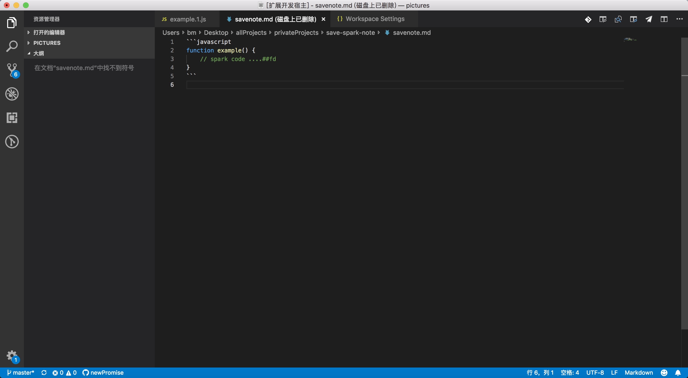

## Save spark note

`save spark note` 是一款用于发送代码文件到qq邮箱的 vscode 扩展，通过这个扩展， 你可以将工作中灵机一动的想法记录下来到本地文件之后通过 `save spark note` 发送到你的邮箱，个人和工作电脑之间传送文件太麻烦？ 通过这个扩展， 你可以一键搞定了。

#### 使用

如图：

点击右上角  发送当前编辑文件到邮箱。

发送成功之后：

除了可以将当前文件发送到你的QQ邮箱之外， 你也可以保存工作或者学习中的代码片段保存到`markdown` 文件，

如图：

选中代码后右键菜单点击 `save exciting code` 

点击之后你选中的代码就会保存了：

配合发送邮件的功能， 你就可以轻松的保存工作中遇到的代码到个人电脑了。

#### 配置

通过 mac: `cmd` + `p`  windows: `win` + `p`  搜索  `settings.json` 进行自定义配置。

| name                        | Type     | Default       | Description                         |
| --------------------------- | -------- | ------------- | ----------------------------------- |
| `savenote.emailsite`        | `String` | ""            | 你的邮箱地址                        |
| `savenote.emailtitle`       | `String` | "spark note"  | 发送文件的标题                      |
| `savenote.emailtype`        | `String` | "qq"          | 邮箱类型                            |
| `savenote.smtppassword`     | `String` | ""            | 邮箱 smtp 密码                      |
| `savenote.smtpport`         | `Number` | 465           | 邮箱 smtp 端口                      |
| `savenote.saveFragDir`      | `String` | ""            | 将要保存的文件夹位置                |
| `savenote.saveFragFileName` | `String` | "savenote.md" | 将要代码片段保存的文件名称          |
| `savenote.saveFragFileType` | `String` | "Md"          | 保存文件的类型， 为 `markdown` 类型 |

