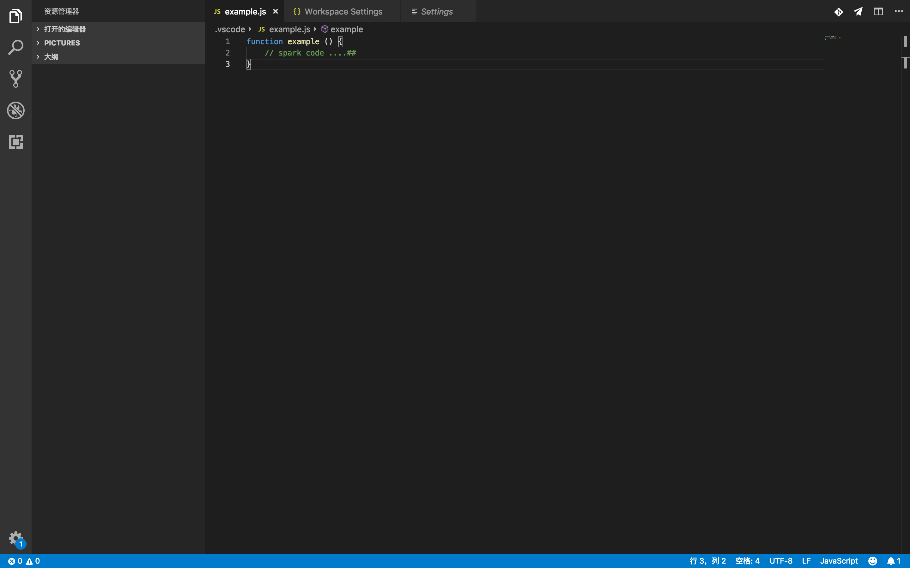
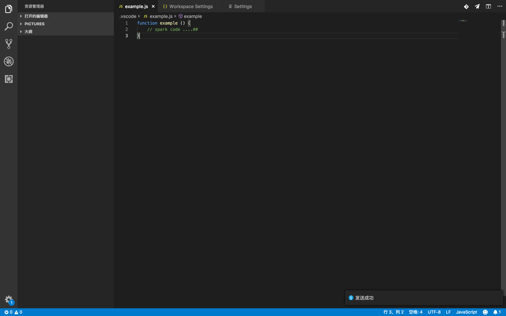

### save spark note

save spark note` 是一款用于发送代码文件到qq邮箱的 vscode 扩展，通过这个扩展， 你可以将工作中灵机一动的想法记录下来到本地文件之后通过 `save spark note` 发送到你的邮箱，个人和工作电脑之间传送文件太麻烦？ 通过这个扩展， 你可以一键搞定了。

#### 使用

如图：

点击右上角  发送当前编辑文件到邮箱。

发送成功之后：

#### 配置
通过 mac: `cmd` + `p`  windows: `win` + `p`  搜索  `settings.json` 进行自定义配置。

| name                    | Type     | Default      | Description    |
| ----------------------- | -------- | ------------ | -------------- |
| `savenote.emailsite`    | `String` | ""           | 你的邮箱地址   |
| `savenote.emailtitle`   | `String` | "spark note" | 发送文件的标题 |
| `savenote.emailtype`    | `String` | "QQ"         | 邮箱类型       |
| `savenote.smtppassword` | `String` | ""           | 邮箱 smtp 密码 |
| `savenote.smtpport`     | `Number` | 465          | 邮箱 smtp 端口 |

